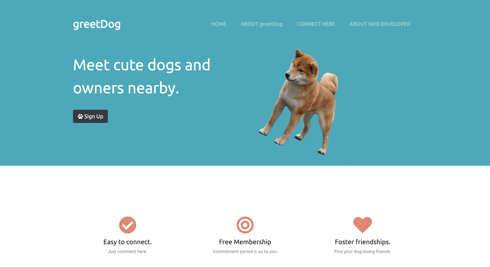
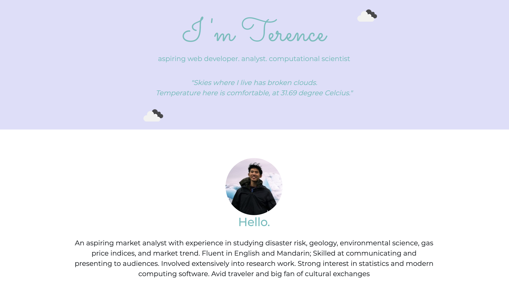
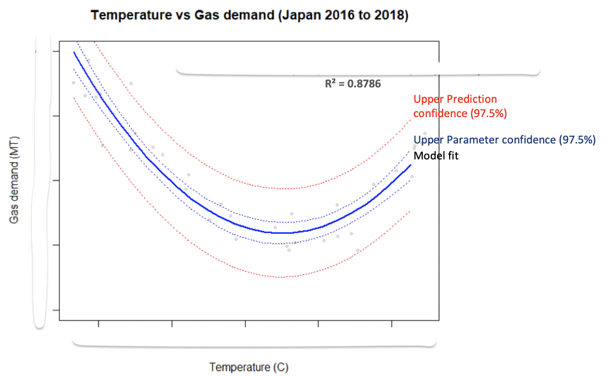
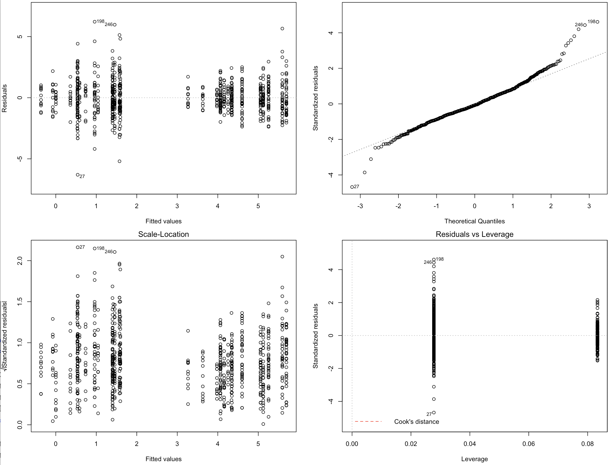
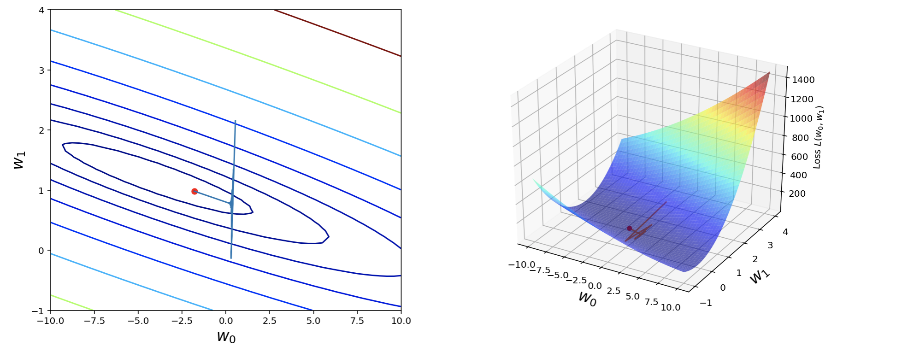

## Portfolio

---

### Web Development

[greetDog](https://github.com/tchua004/greetDog)

### Analytics and Statistics 

[How Exposed is Singapore?](https://github.com/tchua004/ureca_map_r)

---
[Gas Demand Prediction based on weather](https://github.com/tchua004/weather_prediction)

---
[Tourism prediction based on survey](https://github.com/tchua004/japan_tourist)

---
[Soil respiration and its factors](https://github.com/tchua004/soil_respiration_r)

---
[Python class tutorial - supervised regression](https://github.com/tchua004/python_tutorial/tree/master/.gitignore)

---
[Tsunami and its influence on damage states](https://github.com/tchua004/tsunami_predict_r_py)

---

Page template forked from <a href="https://github.com/evanca/quick-portfolio">evanca</a>

<!-- Remove above link if you don't want to attibute -->
