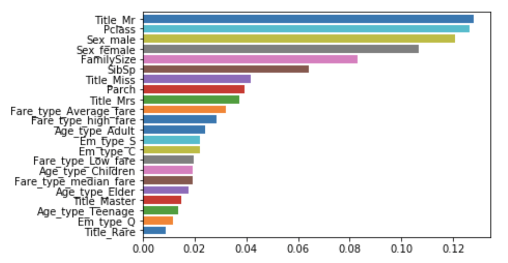
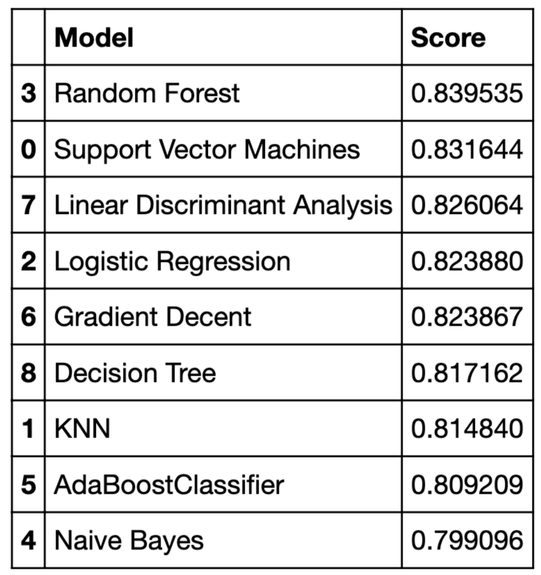
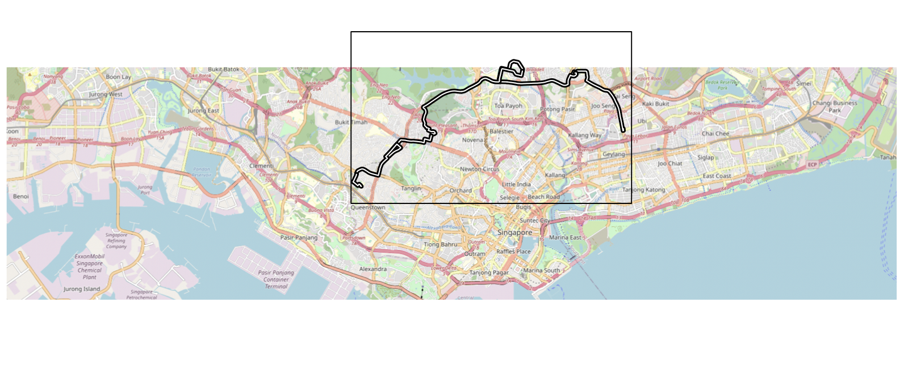
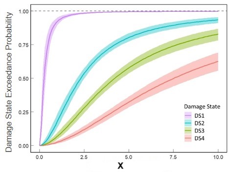

## Portfolio

---

### Analytics and Statistics 

[Visitor's Missing Data Imputation using variational and denoising autoencoders (Pytorch & Tensorflow)]

<figure>
  
  <figcaption>Your label goes here</figcaption>    
</figure>
 
 

---
[Python class tutorial - supervised regression (Sci-kit Learn)](https://github.com/tchua004/python_tutorial)

---
[Kaggle 'Titanic' dataset - supervised regression (Sci-kit Learn)]

---
[GeoAnalytics - Tracing visitor movement behaviors(R)]

---
[Tsunami and its influence on damage states - Probabilistic model and Bootstrapped Confidence(R)](https://github.com/tchua004/tsunami_predict_r_py)

---
[Predictive modelling of Soil respiration (R)](https://github.com/tchua004/soil_respiration_r)

---
[How Exposed is Singapore? - interactive map (R)](https://github.com/tchua004/ureca_map_r)

---
[Gas Demand Prediction based on weather - regression and confidence (R)](https://github.com/tchua004/weather_prediction)

---
[Tourism prediction based on survey - Structured Equation Modelling(R)](https://github.com/tchua004/japan_tourist)

---
[greetDog - simple website made for leisure](https://github.com/tchua004/greetDog)

Page template forked from <a href="https://github.com/evanca/quick-portfolio">evanca</a>

<!-- Remove above link if you don't want to attibute -->
